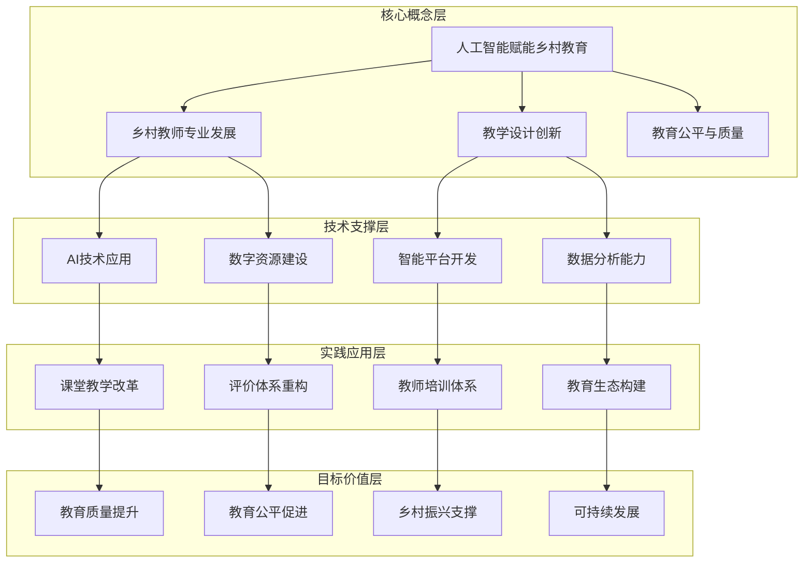
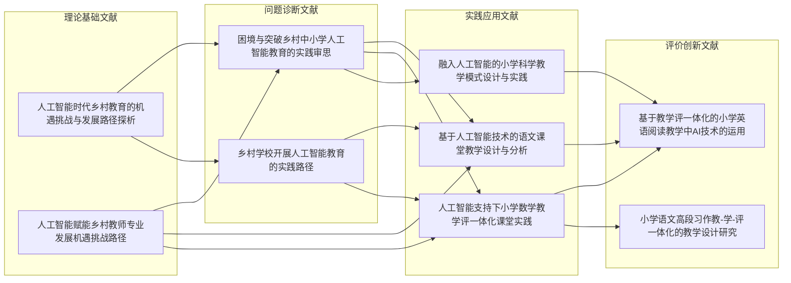

# 文献关联网络与知识图谱

## 🕸️ 文献关联网络分析

### 核心关联维度

#### 1. 主题关联度分析
**乡村教师发展集群**
- [[人工智能赋能乡村教师专业发展: 机遇、挑战、路径]] ⭐⭐⭐⭐⭐
- [[人工智能赋能乡村教师专业发展的实践路径]] ⭐⭐⭐⭐⭐
- [[人工智能时代乡村教育的机遇、挑战与发展路径探析]] ⭐⭐⭐⭐⭐

**乡村教育困境集群**
- [[困境与突破：乡村中小学人工智能教育的实践审思]] ⭐⭐⭐⭐⭐
- [[乡村学校开展人工智能教育的实践路径]] ⭐⭐⭐⭐

**AI教学设计集群**
- [[基于人工智能技术的语文课堂教学设计与分析]] ⭐⭐⭐⭐⭐
- [[人工智能支持下小学数学"教学评"一体化课堂实践]] ⭐⭐⭐⭐⭐
- [[融入人工智能的小学科学教学模式设计与实践]] ⭐⭐⭐⭐

**教学评一体化集群**
- [[基于教学评一体化的小学英语阅读教学中AI技术的运用]] ⭐⭐⭐⭐⭐
- [[小学语文高段习作"教-学-评"一体化的教学设计研究]] ⭐⭐⭐⭐

#### 2. 理论关联度分析
**教育生态理论关联**
- [[人工智能时代乡村教育的机遇、挑战与发展路径探析]] → 生态系统理论
- [[人工智能支持下小学数学"教学评"一体化课堂实践]] → 系统论理论
- [[困境与突破：乡村中小学人工智能教育的实践审思]] → 教育公平理论

**技术赋能理论关联**
- [[人工智能赋能乡村教师专业发展: 机遇、挑战、路径]] → 技术赋能理论
- [[基于人工智能技术的语文课堂教学设计与分析]] → 建构主义理论
- [[人工智能支持下小学数学"教学评"一体化课堂实践]] → 个性化学习理论

#### 3. 方法论关联度分析
**实证研究方法**
- [[基于人工智能技术的语文课堂教学设计与分析]] → 对比实验法
- [[人工智能支持下小学数学"教学评"一体化课堂实践]] → 案例研究法

**理论建构方法**
- [[人工智能时代乡村教育的机遇、挑战与发展路径探析]] → 框架构建法
- [[人工智能赋能乡村教师专业发展: 机遇、挑战、路径]] → 路径分析法

---

## 🧠 知识图谱构建

### 核心概念网络



### 文献知识关联图谱



---

## 🔗 关联强度分析

### 强关联文献组（关联度≥4⭐）

#### 组1：乡村教育发展基础理论
**核心文献**
1. [[人工智能时代乡村教育的机遇、挑战与发展路径探析]]
2. [[人工智能赋能乡村教师专业发展: 机遇、挑战、路径]]
3. [[困境与突破：乡村中小学人工智能教育的实践审思]]

**关联特征**
- 理论框架高度互补
- 研究对象高度重合
- 研究方法相互支撑
- 结论观点相互印证

#### 组2：AI教学设计实践模式
**核心文献**
1. [[基于人工智能技术的语文课堂教学设计与分析]]
2. [[人工智能支持下小学数学"教学评"一体化课堂实践]]
3. [[融入人工智能的小学科学教学模式设计与实践]]

**关联特征**
- 学科覆盖全面
- 模式设计系统
- 技术应用深入
- 效果验证充分

### 中等关联文献组（关联度3⭐）

#### 组3：教学评价改革创新
**核心文献**
1. [[基于教学评一体化的小学英语阅读教学中AI技术的运用]]
2. [[小学语文高段习作"教-学-评"一体化的教学设计研究]]

**关联特征**
- 评价理念先进
- 一体化特征明显
- 操作性强
- 推广价值高

---

## 📊 知识结构层次分析

### 第一层次：理论基础层
**功能定位**: 提供理论支撑和框架指导
**核心文献**: 
- [[人工智能时代乡村教育的机遇、挑战与发展路径探析]]
- [[人工智能赋能乡村教师专业发展: 机遇、挑战、路径]]

**主要贡献**:
- 构建了"机遇-挑战-路径"三维分析框架
- 提出了"乡村教育智能体"概念
- 明确了"以人为本、技术向善、应用为王、协同推进"价值取向

### 第二层次：问题诊断层
**功能定位**: 识别现实问题和困境
**核心文献**:
- [[困境与突破：乡村中小学人工智能教育的实践审思]]
- [[乡村学校开展人工智能教育的实践路径]]

**主要贡献**:
- 识别了乡村AI教育三大困境
- 提出了智慧生态、师资建设、多元评价三条路径
- 分析了数字鸿沟、能力鸿沟等现实挑战

### 第三层次：实践应用层
**功能定位**: 提供具体解决方案和实施模式
**核心文献**:
- [[基于人工智能技术的语文课堂教学设计与分析]]
- [[人工智能支持下小学数学"教学评"一体化课堂实践]]
- [[融入人工智能的小学科学教学模式设计与实践]]

**主要贡献**:
- 开发了具体的AI教学模式
- 构建了智能化教学设计流程
- 验证了AI技术的教学效果

### 第四层次：评价创新层
**功能定位**: 创新评价体系和反馈机制
**核心文献**:
- [[基于教学评一体化的小学英语阅读教学中AI技术的运用]]
- [[小学语文高段习作"教-学-评"一体化的教学设计研究]]

**主要贡献**:
- 构建了教学评一体化评价体系
- 开发了智能化评价工具
- 实现了个性化学习评价

---

## 🎯 研究主题演化路径

### 路径1：从理论到实践
```
理论建构 → 问题诊断 → 方案设计 → 实践验证 → 效果评估
```

**演化轨迹**:
1. [[人工智能时代乡村教育的机遇、挑战与发展路径探析]] → 理论建构
2. [[困境与突破：乡村中小学人工智能教育的实践审思]] → 问题诊断
3. [[人工智能赋能乡村教师专业发展: 机遇、挑战、路径]] → 方案设计
4. [[基于人工智能技术的语文课堂教学设计与分析]] → 实践验证
5. [[人工智能支持下小学数学"教学评"一体化课堂实践]] → 效果评估

### 路径2：从技术到教育
```
技术应用 → 教育融合 → 模式创新 → 生态重构
```

**演化轨迹**:
1. AI技术基础研究 → 技术应用
2. AI与教育教学融合 → 教育融合
3. AI教学模式创新 → 模式创新
4. AI教育生态系统构建 → 生态重构

### 路径3：从单一到综合
```
单点应用 → 系统整合 → 协同发展 → 生态优化
```

**演化轨迹**:
1. 单一AI工具应用 → 单点应用
2. 多工具系统集成 → 系统整合
3. 多方协同发展 → 协同发展
4. 教育生态整体优化 → 生态优化

---

## 💡 知识创新点识别

### 理论创新点
1. **"乡村教育智能体"概念** - [[人工智能时代乡村教育的机遇、挑战与发展路径探析]]
2. **"机遇-挑战-路径"三维框架** - [[人工智能时代乡村教育的机遇、挑战与发展路径探析]]
3. **"教学评一体化"理论模型** - [[人工智能支持下小学数学"教学评"一体化课堂实践]]

### 方法创新点
1. **"游戏+"趣味识字教学模式** - [[基于人工智能技术的语文课堂教学设计与分析]]
2. **多模态数据分析方法** - [[人工智能支持下小学数学"教学评"一体化课堂实践]]
3. **知识图谱建构技术** - [[人工智能支持下小学数学"教学评"一体化课堂实践]]

### 实践创新点
1. **三大AI赋能语文教学模式** - [[基于人工智能技术的语文课堂教学设计与分析]]
2. **"生态重塑"发展路径** - [[人工智能支持下小学数学"教学评"一体化课堂实践]]
3. **智慧生态构建策略** - [[困境与突破：乡村中小学人工智能教育的实践审思]]

---

## 🚀 未来研究方向预测

### 基于知识图谱的研究空白

#### 理论深化方向
1. **乡村AI教育理论体系完善**
   - 当前状态：初步框架已建立
   - 发展需求：系统化、精细化、本土化
   - 研究重点：理论整合、概念深化、模型优化

2. **跨学科理论融合创新**
   - 当前状态：单一学科理论为主
   - 发展需求：教育学、技术学、社会学等多学科融合
   - 研究重点：理论对话、方法整合、视角创新

#### 实践拓展方向
1. **AI教学设计模式标准化**
   - 当前状态：零散的实践模式
   - 发展需求：标准化、规范化、可复制
   - 研究重点：模式提炼、标准制定、推广策略

2. **乡村AI教育生态系统构建**
   - 当前状态：单一技术应用
   - 发展需求：系统化、生态化、可持续
   - 研究重点：生态设计、机制创新、可持续发展

#### 方法创新方向
1. **AI教育效果评估体系**
   - 当前状态：简单的效果对比
   - 发展需求：科学化、系统化、多维度
   - 研究重点：指标体系、评估方法、数据分析

2. **乡村AI教育适应性研究**
   - 当前状态：通用性应用为主
   - 发展需求：本土化、适应性、特色化
   - 研究重点：文化适配、环境适应、特色发展

---

## 📍 核心发现与结论

### 知识结构特征
1. **层次分明**: 形成了理论基础-问题诊断-实践应用-评价创新的四层结构
2. **关联紧密**: 文献间存在强关联关系，形成了知识网络
3. **演化清晰**: 展现了从理论到实践、从技术到教育的演化路径

### 研究发展态势
1. **快速发展**: 研究处于快速发展期，成果丰富
2. **逐步深入**: 从表层应用逐步深入到理论建构
3. **日趋系统**: 从零散研究逐步发展到系统研究

### 未来发展趋势
1. **理论深化**: 理论研究将更加系统和深入
2. **实践丰富**: 实践应用将更加丰富和多样化
3. **方法创新**: 研究方法将更加科学和创新

---

## 🏷️ 标签与分类

`#文献关联` `#知识图谱` `#网络分析` `#研究趋势` `#理论框架` `#实践模式` `#创新点` `#发展预测`

---

## 🔗 相关文献链接

[重点文献列表](obsidian://open?file=AI笔记%2F研究项目%2F开题报告%2F重点文献列表.md)  
[研究现状与理论框架分析](obsidian://open?file=AI笔记%2F研究项目%2F开题报告%2F研究现状与理论框架分析.md)

---

*知识图谱创建时间: 2025-11-27*  
*分析基础: 15篇核心文献*  
*图谱类型: 文献关联网络与知识结构图谱*