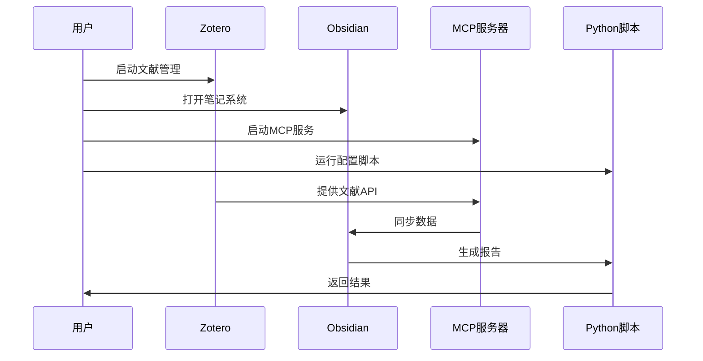

# 依赖关系图

## 🏗️ 系统依赖关系

```mermaid
graph TB
    %% 核心系统
    A[毕业论文AI辅助系统] --> B[Zotero文献管理]
    A --> C[Obsidian笔记系统]
    A --> D[MCP服务器]
    
    %% Zotero依赖
    B --> B1[Zotero 7.0+]
    B --> B2[GB/T 7714-2015 CSL]
    B --> B3[Zotfile插件]
    B --> B4[茉莉花插件-可选]
    B1 --> B5[SQLite数据库]
    
    %% Obsidian依赖
    C --> C1[Obsidian 1.0+]
    C --> C2[Dataview插件]
    C --> C3[Templates插件]
    C --> C4[Graph View插件]
    
    %% MCP服务器依赖
    D --> D1[Node.js LTS]
    D1 --> D2[Express.js]
    D1 --> D3[CORS中间件]
    D --> D4[@modelcontextprotocol/server-zotero]
    D --> D5[@modelcontextprotocol/server-pdf-reader]
    D --> D6[cookjohn/zotero-mcp-可选]
    D --> D7[54yyyu/zotero-mcp-可选]
    
    %% Python工具依赖
    A --> E[Python 3.12+]
    E --> E1[sqlite3]
    E --> E2[pathlib]
    E --> E3[json]
    
    %% 数据流
    B5 --> F[文献元数据]
    F --> G[PDF文件]
    G --> B3
    B3 --> H[注释提取]
    H --> C
    C --> I[知识图谱]
    I --> J[双向链接]
    
    %% 配置依赖
    K[配置文件] --> B
    K --> C
    K --> D
    K1[zotero_obsidian_config.json] --> K
    K2[mcp_config.json] --> K
    K3[core-plugins.json] --> K
    
    %% 样式定义
    classDef coreSystem fill:#e1f5fe
    classDef zoteroSystem fill:#f3e5f5
    classDef obsidianSystem fill:#e8f5e8
    classDef mcpSystem fill:#fff3e0
    classDef pythonSystem fill:#fce4ec
    classDef configSystem fill:#f1f8e9
    
    class A coreSystem
    class B,B1,B2,B3,B4,B5 zoteroSystem
    class C,C1,C2,C3,C4 obsidianSystem
    class D,D1,D2,D3,D4,D5,D6,D7 mcpSystem
    class E,E1,E2,E3 pythonSystem
    class K,K1,K2,K3 configSystem
```

## 📦 包依赖关系

### Node.js依赖树
```
thesis-ai-tools@1.0.0
├── express@4.18.2
│   ├── accepts@1.3.8
│   ├── array-flatten@1.1.1
│   ├── body-parser@1.20.2
│   ├── content-disposition@0.5.4
│   ├── content-type@1.0.5
│   ├── cookie@0.6.0
│   ├── cookie-signature@1.0.6
│   ├── debug@2.6.9
│   ├── depd@2.0.0
│   ├── encodeurl@1.0.2
│   ├── escape-html@1.0.3
│   ├── etag@1.8.1
│   ├── finalhandler@1.2.0
│   ├── fresh@0.5.2
│   ├── http-errors@2.0.0
│   ├── merge-descriptors@1.0.1
│   ├── methods@1.1.2
│   ├── on-finished@2.4.1
│   ├── parseurl@1.3.3
│   ├── path-to-regexp@0.1.7
│   ├── proxy-addr@2.0.7
│   ├── qs@6.11.0
│   ├── range-parser@1.2.1
│   ├── safe-buffer@5.1.2
│   ├── send@0.18.0
│   ├── serve-static@1.15.0
│   ├── setprototypeof@1.2.0
│   ├── statuses@2.0.1
│   ├── type-is@1.6.18
│   ├── utils-merge@1.0.1
│   └── vary@1.1.2
├── cors@2.8.5
│   └── object-assign@4.1.1
└── nodemon@3.0.1
    ├── chokidar@3.5.3
    ├── minimatch@3.0.4
    └── semver@5.7.1
```

### MCP服务器依赖
```
@modelcontextprotocol/server-zotero
├── zotero-api-client
├── zotero-types
└── node-fetch

@modelcontextprotocol/server-pdf-reader  
├── pdf-parse
├── pdfjs-dist
└── sharp
```

## 🔧 插件依赖

### Obsidian插件依赖
```
Dataview
├── moment.js
└── luxon

Templates
├── templater-obsidian (可选)
└── quickadd (可选)

Graph View
├── d3.js
└── vis.js
```

### Zotero插件依赖
```
Zotfile
├── PDFtk Server
├── Java Runtime Environment
└── 文件系统权限

茉莉花插件
├── translators_CN
└── 中文翻译器
```

## 🗄️ 数据存储依赖

### 文件系统结构
```
E:\仓库\毕业论文\
├── config\                    # 配置文件存储
├── ilfow\                     # Node.js应用
├── obsidian\                  # Obsidian库
├── zotero\                    # PDF文件存储
└── docs\                      # 文档存储

%USERPROFILE%\Zotero\          # Zotero数据目录
├── zotero.sqlite             # 主数据库
├── storage\                  # 附件存储
└── profiles\                 # 用户配置
```

### 数据库依赖
```
zotero.sqlite
├── items表                    # 文献条目
├── itemNotes表               # 笔记内容
├── itemAttachments表         # 附件信息
├── collections表              # 收藏夹
└── tags表                    # 标签数据
```

## 🔄 运行时依赖

### 启动顺序
1. **Zotero** - 文献管理基础
2. **Obsidian** - 笔记系统
3. **MCP服务器** - 数据处理服务
4. **Python脚本** - 辅助工具

### 进程依赖


## 🚨 依赖风险

### 单点故障
- **Zotero数据库损坏** → 影响所有文献数据
- **Obsidian库损坏** → 影响所有笔记
- **MCP服务器故障** → 影响数据同步

### 版本兼容性
- **Zotero版本升级** → 可能影响插件兼容性
- **Node.js版本更新** → 可能影响MCP服务器
- **Obsidian版本更新** → 可能影响插件功能

### 缓解措施
- 定期备份Zotero数据库
- 版本控制Obsidian配置
- 锁定关键依赖版本
- 建立故障恢复流程

---
*文档版本: 1.0*
*创建时间: 2025-11-27*
*最后更新: 2025-11-27*