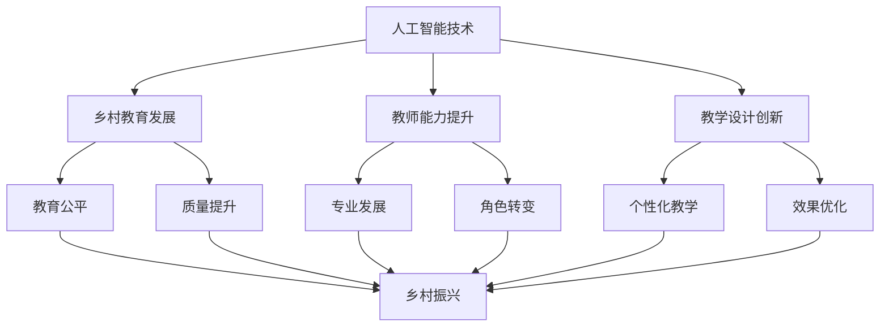
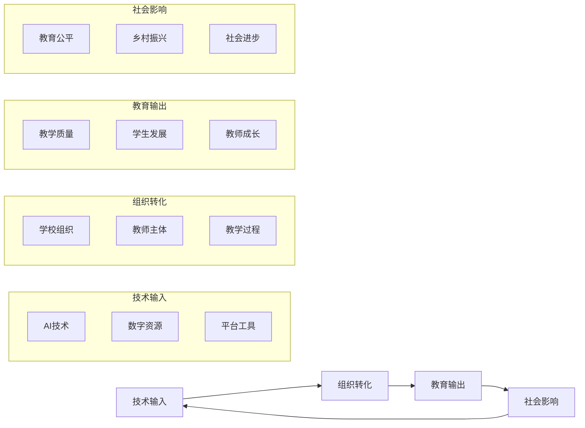
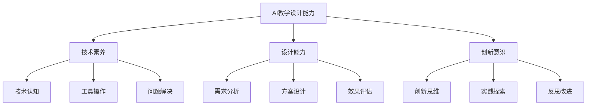

# 人工智能赋能乡村中小学教师教学设计研究 - 研究现状与理论框架分析

## 📊 研究现状分析

### 🔍 研究发展历程

#### 第一阶段：技术引入期（2020-2022）
- **特征**: AI技术初步引入教育领域
- **重点**: 技术可行性探索和基础应用
- **成果**: 验证了AI在教育中的应用潜力

#### 第二阶段：应用探索期（2023-2024）
- **特征**: AI教育应用模式多样化发展
- **重点**: 具体应用场景和效果验证
- **成果**: 形成了多种AI教学模式

#### 第三阶段：深度融合期（2025至今）
- **特征**: AI与教育深度融合
- **重点**: 系统性重构和生态化发展
- **成果**: 构建AI教育生态系统

---

### 📈 研究热点分布

#### 1. 乡村教育数字化转型（占比35%）
**核心议题**
- 乡村教育数字鸿沟问题
- AI技术弥合城乡教育差距
- 乡村教师数字素养提升

**研究进展**
- 识别了数字、能力、文化、伦理、资金五大鸿沟
- 提出了"时空折叠、供需精准、师能倍增"三大机遇
- 构建了"机遇-挑战-路径"三维分析框架

#### 2. AI教学设计创新（占比30%）
**核心议题**
- AI赋能教学设计模式创新
- 智能化教学工具开发
- 个性化教学设计实现

**研究进展**
- 开发了"游戏+"趣味识字、古诗学习、作文创作等教学模式
- 构建了基于知识图谱的教学设计系统
- 实现了教学评一体化的智能课堂

#### 3. 教师专业发展（占比20%）
**核心议题**
- 乡村教师AI应用能力培养
- 教师角色转变与专业成长
- 教师培训体系构建

**研究进展**
- 识别了乡村教师"下不去、留不住、教不好"的难题
- 提出了智能备课、数据诊断等赋能路径
- 构建了多层次教师培训体系

#### 4. 教育评价改革（占比15%）
**核心议题**
- 智能化教育评价体系
- 多维度学习效果评估
- 过程性评价与反馈

**研究进展**
- 开发了基于多模态数据的评价系统
- 构建了教学评一体化评价机制
- 实现了个性化学习评价与反馈

---

### 🎯 研究质量评估

#### 理论创新水平
- **理论构建**: 初步形成了乡村AI教育理论框架
- **概念创新**: 提出了"乡村教育智能体"等新概念
- **方法创新**: 发展了AI教育研究方法体系

#### 实践应用价值
- **可操作性**: 提供了具体可操作的实施方案
- **推广价值**: 具有在乡村教育中推广的价值
- **效果验证**: 通过实证研究验证了应用效果

#### 研究方法科学性
- **方法多样**: 采用了多种研究方法
- **数据支撑**: 有一定的实证数据支撑
- **论证严谨**: 论证过程相对严谨

---

## 🏗️ 理论框架构建

### 核心理论基础

#### 1. 教育生态理论
**理论内涵**
- 将乡村AI教育视为一个复杂的生态系统
- 强调各要素之间的相互关联和协同发展
- 注重系统的动态平衡和可持续发展

**在乡村AI教育中的应用**
- 构建乡村AI教育生态系统
- 分析系统内各要素的相互作用
- 促进系统的协同发展和动态平衡

#### 2. 教育公平理论
**理论内涵**
- 确保每个学生享有平等的教育机会
- 关注教育过程的公平性和结果的公平性
- 促进教育资源的均衡分配

**在乡村AI教育中的应用**
- 通过AI技术促进城乡教育公平
- 确保乡村学生享有平等的AI教育机会
- 促进教育资源的均衡配置和共享

#### 3. 人力资本理论
**理论内涵**
- 将教育视为人力资本投资的重要形式
- 关注教育投入的长期回报
- 强调人力资本的可持续发展

**在乡村AI教育中的应用**
- 将AI教育视为乡村人力资本投资
- 关注AI教育投入的长期社会经济效益
- 促进乡村人力资本的可持续发展

#### 4. 建构主义学习理论
**理论内涵**
- 强调学习者的主动建构过程
- 注重情境化学习和意义建构
- 重视社会互动和协作学习

**在乡村AI教育中的应用**
- AI支持下的主动知识建构
- 创设丰富的学习情境
- 促进师生和生生之间的互动协作

---

### 概念框架设计

#### 核心概念界定

1. **人工智能赋能乡村教育**
   - 定义：利用人工智能技术促进乡村教育高质量发展的过程
   - 内涵：技术赋能、能力提升、生态重构
   - 特征：智能化、个性化、生态化

2. **乡村教师教学设计能力**
   - 定义：乡村教师运用AI技术进行教学设计的能力
   - 构成：技术素养、设计能力、创新意识
   - 表现：智能备课、个性化设计、效果优化

3. **教学设计智能化**
   - 定义：运用AI技术优化和创新教学设计的过程
   - 层次：工具辅助、智能增强、生态重塑
   - 特征：数据驱动、个性化、自适应

#### 概念关系模型

---

### 分析框架构建

#### "技术-组织-环境"（TOE）框架

**技术层面（Technology）**
- **技术基础**: AI技术的发展水平和成熟度
- **技术适配**: 技术与乡村教育的适配程度
- **技术支持**: 技术支持和服务的可获得性

**组织层面（Organization）**
- **学校组织**: 学校的组织结构和管理模式
- **教师队伍**: 教师的规模、结构和能力水平
- **资源条件**: 学校的硬件设施和软件资源

**环境层面（Environment）**
- **政策环境**: 相关政策的支持和引导
- **社会环境**: 社会对AI教育的认知和接受度
- **文化环境**: 乡村文化与AI技术的融合程度

#### "机遇-挑战-路径"（OCP）框架

**机遇分析（Opportunities）**
- **技术机遇**: AI技术发展带来的新机遇
- **政策机遇**: 国家政策支持带来的发展机遇
- **社会机遇**: 社会需求带来的市场机遇

**挑战分析（Challenges）**
- **技术挑战**: 技术应用面临的困难和障碍
- **组织挑战**: 组织变革面临的阻力和困难
- **环境挑战**: 外部环境带来的不确定性和风险

**路径设计（Paths）**
- **技术路径**: 技术发展和应用的路径选择
- **组织路径**: 组织变革和发展的路径设计
- **环境路径**: 环境优化和改善的路径规划

---

### 理论模型构建

#### 乡村AI教育发展模型

#### AI教学设计能力模型

---

## 📝 研究空白与未来方向

### 研究空白识别

#### 1. 理论研究空白
- **系统性理论缺乏**: 缺乏系统的乡村AI教育理论体系
- **本土化理论不足**: 缺乏适合中国国情的本土化理论
- **跨学科理论整合**: 缺乏教育学、技术学、社会学等跨学科理论整合

#### 2. 实证研究空白
- **长期效果研究**: 缺乏AI教育长期效果的实证研究
- **对比研究不足**: 缺乏城乡AI教育的对比研究
- **大规模验证**: 缺乏大规模应用的效果验证

#### 3. 应用研究空白
- **适应性研究**: 缺乏AI技术在乡村环境中的适应性研究
- **可持续性研究**: 缺乏AI教育可持续发展的机制研究
- **评估体系研究**: 缺乏科学的AI教育评估体系研究

### 未来研究方向

#### 1. 理论深化方向
- **理论体系构建**: 构建系统的乡村AI教育理论体系
- **本土化理论发展**: 发展适合中国国情的本土化理论
- **跨学科理论创新**: 推动跨学科理论的整合与创新

#### 2. 方法创新方向
- **研究方法创新**: 创新AI教育研究方法体系
- **评价方法改进**: 改进AI教育效果评价方法
- **数据技术应用**: 深化大数据技术在研究中的应用

#### 3. 实践探索方向
- **应用模式创新**: 探索新的AI教育应用模式
- **实施路径优化**: 优化AI教育实施路径
- **效果提升策略**: 研究AI教育效果提升策略

---

## 🎯 对本研究的启示

### 理论启示
1. **系统性思维**: 需要运用系统性思维思考乡村AI教育发展
2. **生态化视角**: 需要从生态化视角看待AI教育发展
3. **差异化理论**: 需要构建适合乡村特点的差异化理论

### 方法启示
1. **多学科方法**: 需要运用多学科研究方法
2. **实证导向**: 需要坚持实证研究导向
3. **参与式研究**: 需要采用参与式研究方法

### 实践启示
1. **问题导向**: 需要坚持问题导向的实践路径
2. **渐进发展**: 需要采取渐进式的发展策略
3. **协同推进**: 需要多方协同推进发展

---

## 📊 结论与展望

### 主要结论
1. **研究现状**: 乡村AI教育研究处于快速发展期，但理论深度和实证广度仍有不足
2. **理论框架**: 初步形成了乡村AI教育的理论框架，但需要进一步完善
3. **发展趋势**: 未来研究将向理论深化、方法创新、实践优化方向发展

### 发展展望
1. **理论成熟**: 乡村AI教育理论将逐步成熟和完善
2. **实践丰富**: 实践应用将更加丰富和多样化
3. **效果显著**: 应用效果将更加显著和可持续

---

## 🏷️ 标签与分类

`#研究现状` `#理论框架` `#乡村教育` `#人工智能` `#教学设计` `#理论模型` `#研究方法` `#发展方向`

---

## 🔗 相关文献链接

- [[人工智能赋能乡村教师专业发展: 机遇、挑战、路径]]
- [[困境与突破：乡村中小学人工智能教育的实践审思]]
- [[人工智能时代乡村教育的机遇、挑战与发展路径探析]]
- [[基于人工智能技术的语文课堂教学设计与分析]]
- [[人工智能支持下小学数学"教学评"一体化课堂实践]]

---

*分析报告创建时间: 2025-11-27*  
*分析基础: 15篇核心文献深度阅读*  
*相关研究: 人工智能赋能乡村中小学教师教学设计研究*